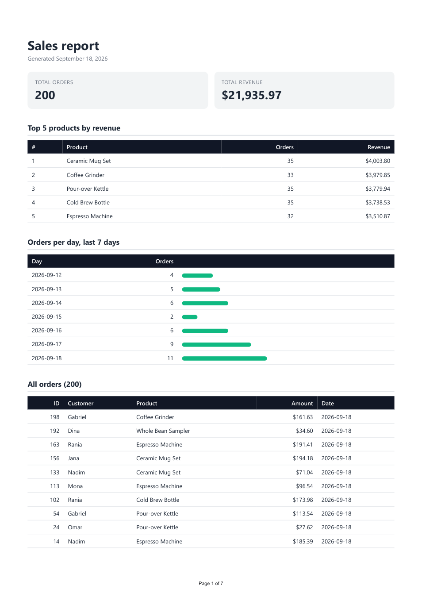
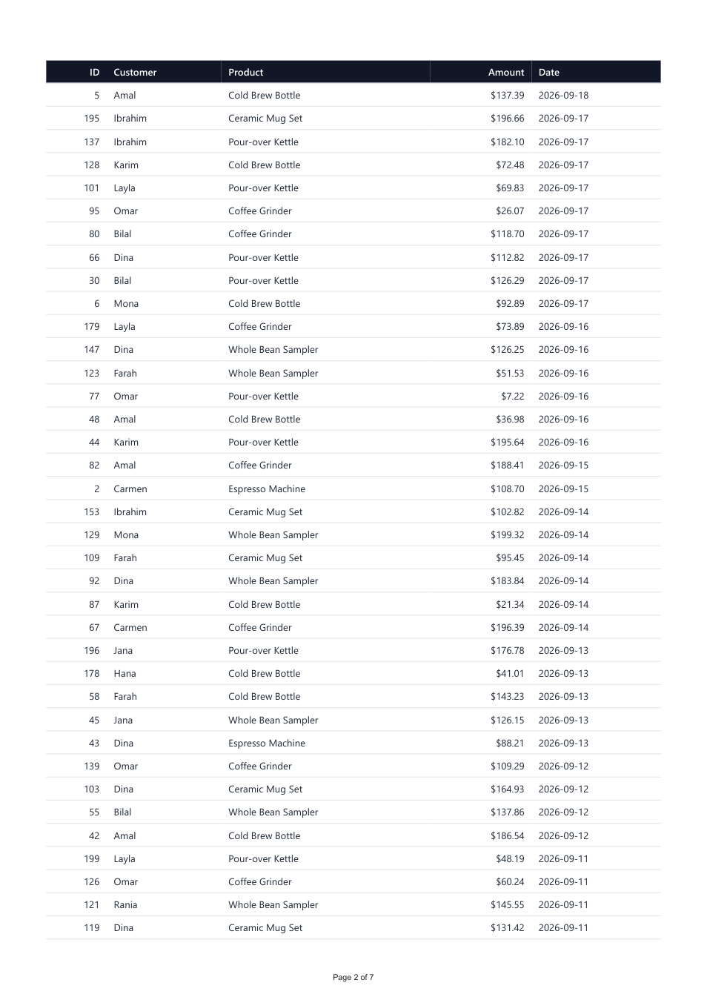
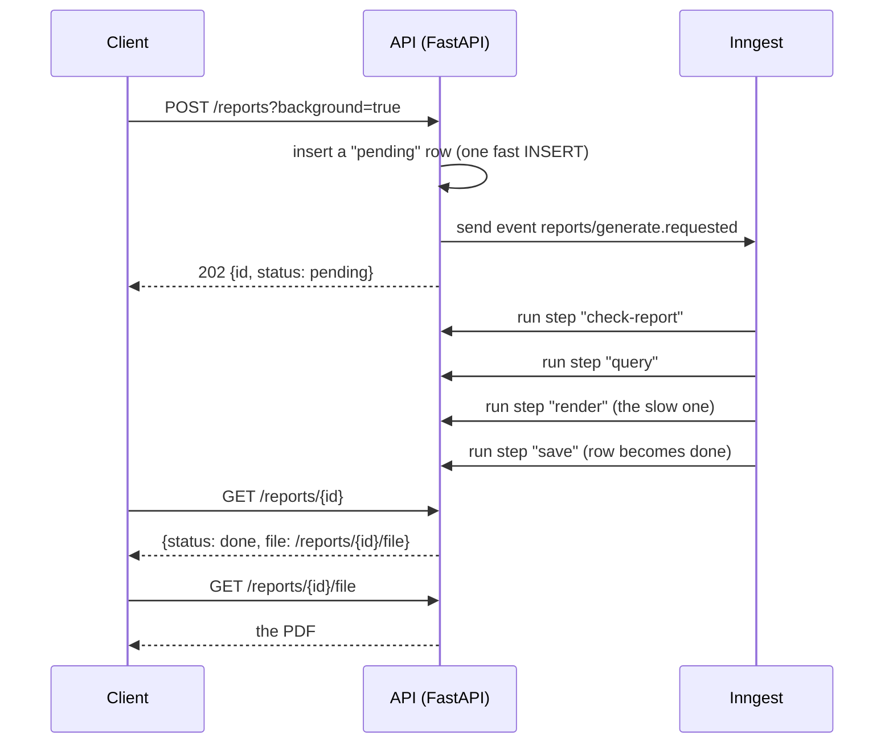
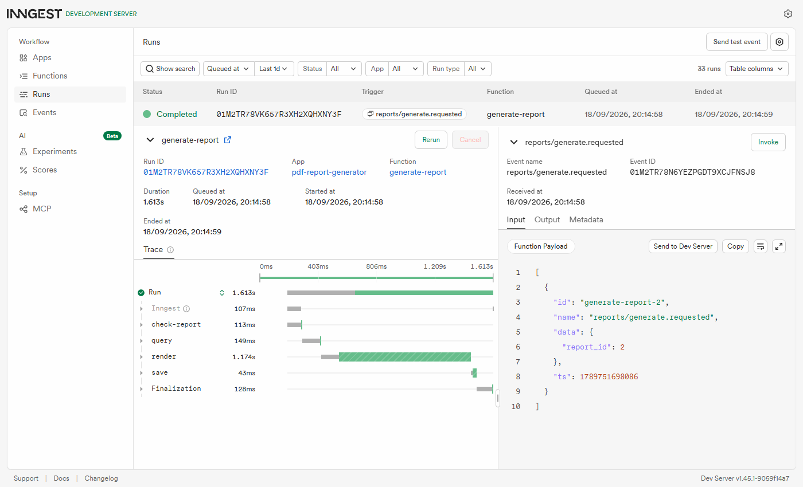

# PDF report generator

A small FastAPI service that turns rows in a SQLite database into a real PDF report. A few SQL aggregation queries shape the data, a headless browser prints an HTML page to PDF, the file is stored on disk, and the API hands it out by link.



*Page 1 of a generated report.* The long orders table continues over 6 more pages, with its header repeated on each one:



## The pipeline

| Move | What it does | Where |
| --- | --- | --- |
| Query | One set of SQL queries turns 200 rows into a few numbers | `report_data.py` |
| Render | An HTML template plus those numbers becomes a PDF (headless Chromium via Playwright) | `render.py` |
| Store | The PDF is saved to `reports/<id>.pdf` and its path recorded in the database | `reports_service.py` |
| Serve | The client downloads it by link; JSON never carries the file's bytes | `main.py` |

## Dataset

**Option A, the little shop.** `report.db` has one table, `orders` (`id`, `customer`, `product`, `amount`, `created_at`). `seed.py` inserts 200 invented orders: 6 products, amounts between 5 and 200, dates in the last 30 days. It starts by deleting every row, so running it twice still leaves exactly 200.

## Run it

Needs Python 3.10+.

```bash
python -m venv venv
venv\Scripts\activate            # macOS/Linux: source venv/bin/activate
pip install -r requirements.txt
playwright install chromium       # one-time download, about a minute

python seed.py                    # creates report.db with 200 orders
uvicorn main:app --port 8000      # starts the API
```

Then, in another terminal:

```bash
curl -i -X POST http://localhost:8000/reports          # generates a report, answers with a link
curl -o my-report.pdf http://localhost:8000/reports/1/file
```

Interactive docs are at http://localhost:8000/docs.

| Endpoint | Does |
| --- | --- |
| `GET /health` | `{"status": "ok"}` |
| `POST /reports` | Generates a report inside the request and answers `201` with `{"id", "file", "status"}`. If one was already generated today it answers `200` with that one instead. Body `{"force": true}` always generates a new one. |
| `POST /reports?background=true` | Same idea, but an Inngest job does the work: answers `202` in milliseconds with a `pending` report (see [the stretch](#stretch-generate-it-as-a-background-job-inngest)). |
| `GET /reports/{id}` | The record (`id`, `path`, `created_at`, `status`, `error`, `file`). `status` is `pending`, `done` or `failed`; `file` is a link once done. Unknown id gives `404`. |
| `GET /reports/{id}/file` | The PDF itself (`application/pdf`). Unknown id, or a file missing on disk, gives `404`; a report that is still `pending` or has `failed` gives `409` with the reason. |

## The aggregation SQL

These are the queries in `report_data.py`; `get_report_data()` runs them and returns one dict.

Totals:

```sql
SELECT COUNT(*)                          AS total_orders,
       ROUND(COALESCE(SUM(amount), 0), 2) AS total_revenue
FROM orders
```

Top 5 products by revenue:

```sql
SELECT product,
       COUNT(*)              AS orders,
       ROUND(SUM(amount), 2) AS revenue
FROM orders
GROUP BY product
ORDER BY revenue DESC
LIMIT 5
```

Orders per day for the last 7 days:

```sql
WITH RECURSIVE days(day) AS (
    SELECT date(:today, '-6 days')
    UNION ALL
    SELECT date(day, '+1 day') FROM days WHERE day < date(:today)
)
SELECT days.day AS day, COUNT(orders.id) AS orders
FROM days
LEFT JOIN orders ON orders.created_at = days.day
GROUP BY days.day
ORDER BY days.day
```

The last query builds the 7 calendar days with a recursive CTE and `LEFT JOIN`s the orders onto them. A plain `GROUP BY created_at` would silently skip a day with no orders; this one reports it as `0`.

## Proof: POST, then download

Real output from a run against the seeded database (`force` makes it generate rather than reuse today's report):

```
$ time curl -i -X POST http://localhost:8000/reports -H "Content-Type: application/json" -d "{\"force\": true}"
HTTP/1.1 201 Created
content-type: application/json
{"id":5,"file":"/reports/5/file","status":"done"}
real    0m1.316s

$ curl http://localhost:8000/reports/5
{"id":5,"path":"reports/5.pdf","created_at":"2026-09-18T21:08:03","status":"done","error":null,"file":"/reports/5/file"}

$ curl -o my-report.pdf http://localhost:8000/reports/5/file
HTTP 200  application/pdf  73365 bytes      (starts with %PDF-1.4)
```

The wait before the `201` is the pipeline running inside the request; more on that below.

## Serving the report (Stage 4)

`POST /reports` runs the whole pipeline inside the request (query, render, save the PDF to disk, remember its path) and answers `201` with a link. `GET /reports/{id}` returns the record, and `GET /reports/{id}/file` streams the PDF from disk. JSON responses only ever carry the link, never the file's bytes.

**When would I move this work out of the request?** Today the wait is about 2 seconds for 200 rows, which is fine for one person clicking one button. I would move it out of the request once it takes more than roughly 10 seconds, or as soon as several people can ask at once: every request launches its own Chromium (about 2 s of CPU and a lot of memory each), so a handful of concurrent reports would exhaust the server's workers, and a slow request risks hitting a proxy or browser timeout and being retried into a second, duplicate report.

## Ask twice, get one (Stage 5)

`POST /reports` returns the report already generated today (`200`) instead of making another (`201`). Send `{"force": true}` to generate a fresh one anyway.

**What the check protects against:** a double-click, a page refresh, or a client or proxy that retries a slow request would otherwise produce a duplicate report each time, and every duplicate costs about two seconds of CPU and a Chromium launch. A real-world example where a missing check costs money is a customer being charged, or emailed an invoice, twice because a "Pay" button was clicked twice or a request was retried, which means a refund, a support ticket, and a customer who trusts you a little less.

**The naive version is broken, and I watched it break.** My first implementation was "check whether today's report exists, and if not, generate one". Firing two simultaneous requests with `prove_double_click.py` produced two files (ids 1 and 2): the second request checks while the first is still rendering, finds nothing in the database yet, and generates its own. The fix is a lock around check and generate, so the second request waits, then finds the first one's report.

```
python prove_double_click.py --reset
  request 1: HTTP 201  {'id': 1, 'file': '/reports/1/file'}
  request 2: HTTP 200  {'id': 1, 'file': '/reports/1/file'}
  new files in reports/: 1 ['1.pdf']
  POST with {"force": true}: HTTP 201  {'id': 2, ...}
```

**Limit:** a `threading.Lock` only protects one server process. With several workers or instances the database has to referee instead, for example by inserting a "claimed" row first under a unique constraint, or using a database-level lock, and only then rendering.

## Stretch: generate it as a background job (Inngest)

`POST /reports?background=true` claims a report id, sends an event, and answers `202` straight away. An Inngest function then runs **query, render, save** as separate steps, and `GET /reports/{id}` reports `pending` until it says `done`. The default in-request mode from Stages 4 and 5 is untouched.



### Run it

Three things need to be running: the API, the Inngest dev server (needs Node for `npx`), and you. The dev server finds the app on its own:

```bash
uvicorn main:app --port 8000
npx --yes inngest-cli@latest dev -u http://127.0.0.1:8000/api/inngest   # dev UI: http://localhost:8288

curl -i -X POST "http://127.0.0.1:8000/reports?background=true"
curl http://127.0.0.1:8000/reports/1
```

The app runs the Inngest SDK in dev mode by default. Set `INNGEST_PRODUCTION=1` (with Inngest's event and signing keys) to run against Inngest Cloud.

### Proof

Real output, polling the report every 50 ms right after asking for it (`127.0.0.1` rather than `localhost`, which on Windows can stall about 2 s on IPv6 and would distort the timing):

```
+ 0.08s  POST -> HTTP 202  {'id': 7, 'status': 'pending', 'file': None, 'status_url': '/reports/7'}
+ 0.10s  file -> HTTP 409 {"detail":"Report 7 is still being generated"}
+ 0.10s  GET  -> status=pending  file=None
+ 1.90s  GET  -> status=done  file=/reports/7/file
```

The dev UI shows each step as its own timed step. `render` is the slow one, which is the whole point of moving it out of the request:



Each step is remembered once it succeeds: if `render` fails and is retried, `query` is not run again.

### What got better for the user, and what got more complex for me

**Better:** the request answers in under 0.1 s instead of freezing for about 2 s, the user gets a link they can come back to, and the double-click race mostly disappears, because the only thing done under the lock is one fast `INSERT` of a pending row that the next request sees immediately.

**More complex:** a second process to run (the Inngest dev server), a `pending / done / failed` lifecycle with its own ways to go wrong, a job that has to be safe to retry, and two things I only found by testing them (below).

### What goes wrong, and what happens

| Situation | What happens |
| --- | --- |
| Inngest can't be reached when the report is requested | `502` with a clear message, and the report is marked `failed` instead of being left `pending` forever. |
| A step fails (I tested this by making Chromium unavailable) | Inngest retries the job twice, then the report becomes `failed` with the real reason, about 55 s in my test. `GET /reports/{id}/file` answers `409` with that reason. |
| The job never starts (event lost, dev server restarted) | A report still `pending` after 5 minutes (`REPORT_PENDING_TIMEOUT_SECONDS`, default 300) is marked `failed` with a timeout message, so a client polling it stops waiting. |
| A report failed | It doesn't count as "today's report": asking again generates a new one. |

```
[+  0.1s] POST -> 202 {'id': 5, 'status': 'pending', ...}
[+ 54.7s] status=failed error="BrowserType.launch: Executable doesn't exist at ...\no-browsers..."
```

### Two bugs the tests found

1. **A silently dropped event.** I first used `generate-report-<report id>` as the event's idempotency id. Inngest ignores an event whose id it has already seen in the last 24 hours, and after I emptied the table the ids started again from 1, so "new" report 4 was treated as a duplicate of an old one. The job never ran and the report stayed `pending` for good. The id now includes the report's creation time as well.
2. **Nothing ever gave up on a stuck report.** That same incident showed a report could wait forever. Hence the 5-minute expiry above.

## How I checked it

Each stage ends with a checkpoint, and each has a script so it can be re-run:

| Script | What it proves |
| --- | --- |
| `python check_report_data.py` | Recomputes every number in plain Python from the raw rows and compares it with the SQL result (totals, top 5, per-day counts, no product bigger than the total). |
| `python verify_pdf.py [file.pdf]` | Reads the PDF back: at least 2 pages, the table header on every page that has rows, and all 200 orders present exactly once as complete lines (needs `pip install -r requirements-dev.txt`). |
| `python prove_double_click.py --reset` | Fires two simultaneous POSTs and checks they return the same id and produce one new file. Add `--background` to run the same proof against the Inngest mode. |

**About the page-break trap.** The surprise is that I could not make it bite. I rendered the same data with the print CSS removed entirely, and every row was still intact and the header still repeated, because Chromium already keeps single-line table rows whole and repeats a real `<thead>` by default. What did break the check was replacing `<thead>` with an ordinary header row: the header then appeared on page 1 only (missing on pages 2-6). So the rule that matters here is *use a real `<thead>`*; `tr { break-inside: avoid }` is a safeguard for taller, multi-line rows that this dataset does not have.

I also checked that a failed render leaves nothing behind: if Chromium crashes, or the finished file cannot be moved into place, there is no stray database row and no leftover file.

## Project layout

```
main.py              FastAPI routes
reports_service.py   generate, store, look up, the once-per-day lock, and the job's steps
jobs.py              the Inngest client and the background function (query -> render -> save)
report_data.py       the aggregation SQL and get_report_data()
render.py            HTML template and Playwright PDF rendering
db.py                database path and schema
seed.py              fills report.db with 200 orders (safe to run twice)
show_report.py       prints the report data as JSON
check_report_data.py, verify_pdf.py, prove_double_click.py   the checks above
docs/                the screenshots used in this README (the PDF pages and the Inngest trace)
```

`reports/` and `report.db` are generated, so they are in `.gitignore`; `seed.py` and the API are their recipe.

## Limits

- **By default everything runs inside the request.** That is the assignment's design, and the Stage 4 answer above says where it stops being acceptable; `?background=true` is the way out.
- **The job's steps share one disk.** `render` leaves a temp file that `save` moves into place, so both must run on the same machine. With several machines, `render` would upload to object storage and pass a link instead.
- **The once-per-day lock is per process** (see Stage 5). Behind several workers, let the database referee.
- **"Today" is the server's local date.**
